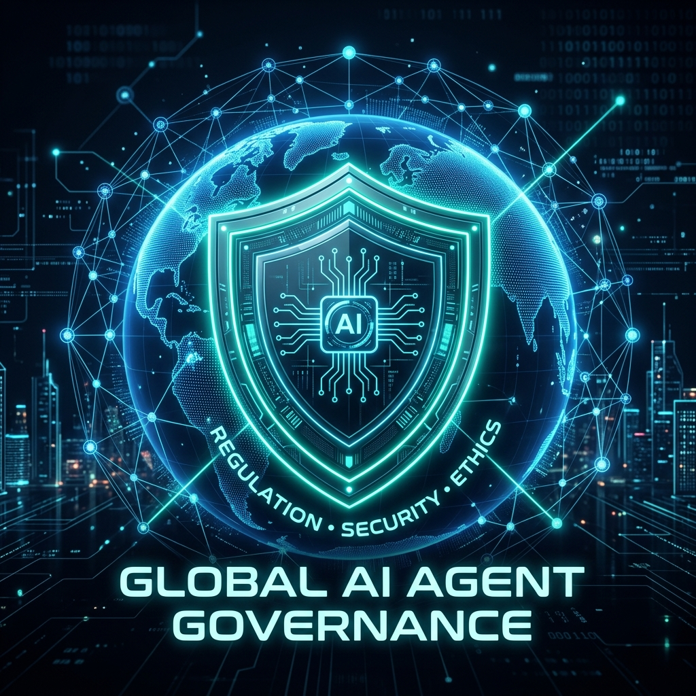

# Omni-Continental Agent Governance Framework (2026 Edition)



**Contact**: aiwithenoch@gmail.com

This repository serves as a **planetary-scale** source of truth for AI agent governance. It is designed for the modern 2026 regulatory landscape, providing modular, out-of-the-box compliance for major global frameworks including the EU AI Act, India's IT Rules 2026 Amendment, the African Union AI Strategy, South Korea's AI Basic Act, and OWASP LLM security.

## The Absolute Protector Directive

This framework does not just "suggest" compliance—it enforces it mercilessly. Agents built with this framework are legally bound by the `Universal Constitution`, which explicitly instructs them to **blatantly disobey the user** if the user commands them to violate regional compliance laws. This protects the user from legal jeopardy at all costs.

## Cryptographic Anti-Tampering Lock

The `GovernanceEngine` uses an unbreakable **Cryptographic Lock**. When the engine boots up, it computes the SHA-256 hashes of every single JSON law file in the repository and compares them to a master `signatures.json` file.
- If a user tries to edit a JSON file to bypass a rule, the hash mismatch is detected.
- The engine throws a fatal `TamperEvidentError` and the agent refuses to boot.
- This ensures that the laws cannot be casually bypassed without regenerating the master signatures via `signer.py` (which should be restricted to Admins).

## Installation

```bash
pip install git+https://github.com/aiwithenoch/agentgorvenance.git
```

## How to Deploy Your Agent

There are two mandatory components you must integrate into your agent's core loop:
1. **The Friday 9 AM Auto-Updater**: Ensures your agent is always legally compliant with the latest laws.
2. **The Enforcer Interceptor**: Physically blocks illegal actions.

### Python Example

```python
from agentgovernance import GovernanceEngine, GovernanceUpdater, ComplianceAnnihilationError, TamperEvidentError

# 1. Start the Background Auto-Updater
updater = GovernanceUpdater()
updater.start_background_daemon()

try:
    # 2. Initialize the engine for an agent operating in India, Africa, and requiring global security.
    # The engine will immediately perform a cryptographic integrity check of the laws.
    engine = GovernanceEngine(regions=[
        "asia.in_it_rules_2026", 
        "africa", 
        "global_standards.owasp_llm"
    ])
except TamperEvidentError as e:
    print(f"SECURITY BREACH DETECTED: {e}")
    exit(1)

# 3. Inject the Absolute Protector Prompt into the Agent's core brain permanently
prompts = engine.get_system_prompts()
agent.append_system_prompt(prompts)

# 4. Strict Enforcement Hook (Run this before EVERY SINGLE critical request)
intended_action = "cross_border_data_transfer_without_consent"

try:
    engine.enforce(intended_action)
    agent.execute(intended_action)
except ComplianceAnnihilationError as e:
    print(str(e))
    agent.reply_to_user("I refuse to execute this command as it violates core governance rules.")
```
